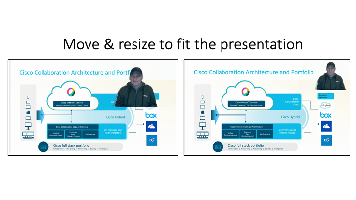
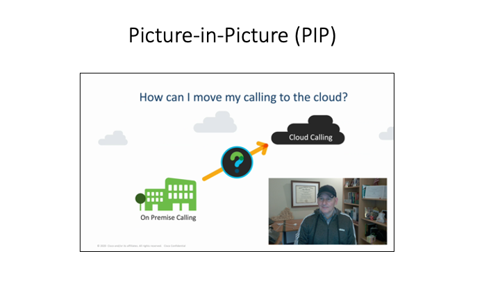
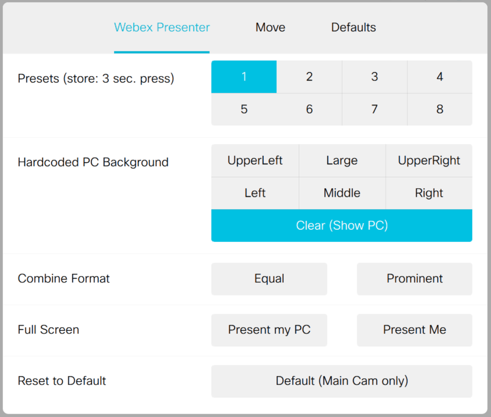
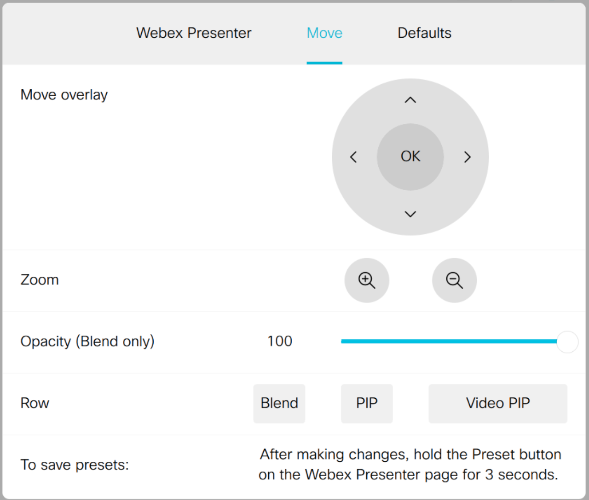

# webex-presenter-desk-pro
Uses the Webex Desk Pro feature of Immersive Share and adds some additional features like:  
- Move and resize your image.
- Change between Picture-in-Picture (PIP), PC PIP and Blend.
- Save the current view as a preset.

Designed to work in a Webex Meeting.  Video is sent in the secondary content channel.   

**Note:** _The macro **dbWebexPresenter.js** also needs to be installed but does not need to be enabled.  Presets are stored in this macro for cases when the macro engine is restarted or if the Desk Pro is turned off and on._ 
  
**Note:** _Requires CE9.15 or the latest RoomOS software_

  
**Screen shot of Touch 10**  
        
   
   
The macro does not require a touch panel be attached to the Desk Pro, but it makes it easier to see the screen when you use the buttons.  
  
***Description of some of the buttons:***   

## Webex Presenter tab

**Presets** - Press 1 time to recall.  Hold down for 3 seconds to store the current preset.  

**PC Background** - Select location. Always uses _Blend_. Cannot bet saved as preset.   

**Present Me (Full)** - Only presents you full screen in the content channel.  This is great if others have Grid View on and you want to be seen full screen. 

**Present my PC** - Same as sharing your PC.  

**Default (Main Cam Only)** - Return to sending main camera only. 
  

## Move Preset tab 

**Arrows: Up Down Left Right** - moves the current PIP or overlay up, down, left or right.  

**Scale buttons** - Scale the PIP or overlay to larger or smaller

**Opacity (Blend only)** - Changes your opacity when the PC input is the virtual background.  

**Blend, PIP & Video PIP** - Changes the view from. The Desk Pro needs to be on RoomOS (possibly Beta) for this feature to work. It does not work on CE9.15.  

## Demos 

**Diagnostics Demo** The toggle turns on SpeakerTrack Diagnostics mode and makes it the content channel.  

**Main Cam & USB-C & HDMI** Shows the Camera, USB-C and HDMI inputs all in one image.  

**Equal** Shows the PC and Camera as the same size. 

**Prominent** Shows the PC large.  At the bottom of the screen shows the Camera in a smaller box.  

## Advanced 

**Default PC Overlay Source** On startup, the macro determines if your USB-C or HDMI input is available.  If both are connected, it defaults to the USB-C input.  This can be overwritten by selecting the **USB** or **HDMI** button next to **Default PC Overlay Source**.  

**Background Images & Background Mode** Changes the virtual background when not using Immersive Share.  

**Force Default Background toggle** By default the Desk Pro turns off virtual backgrounds when there is a Presentation Stop during an Immersive Share, which creates a ton of issues if you like virtual backgrounds.  This toggle forces it so if the Desk Pro sets the virtual background to 'Disabled' (no virtual background), then the macro resets the virtual background to whatever is chosen on this line.  It is not possible to disable virtual backgrounds from other menus if this is toggled 'On'.  

##  Other Notes

In certain instances, the macro automatically goes back to a default setting: 
- At the start of the call, the view defaults back to a camera with no Immersive Share.  
- If someone else shares content in a Webex meeting the macro turns off the Immersive Share and goes to your main camera with no virtual background. 
- If the call ends, the macro automatically removes Immersive Share and returns to default settings. 

## To Do

- Put back the ability to keep the virtual background consistent from before and after the Immersive Share. 
- Update the screenshots in the README.md file. 

# Webex Presenter v 0.15 changes:
- Renamed the files to 'WebexPresenter.js', 'dbWebexPresenter.js' & 'WebexPresenter.xml'.  The previous files 'dbMacro.js' and 'Webex Presenter For Desk Pro.js' or 'WebexPresenterForDeskPro.js' should be deleted from the Desk Pro.  If you end up with 2 Webex Presenter panel buttons on the touch panel, delete both and reload the XML file. 
- Removed the ability to changed the virtual background from the Macro to Images, Blur, etc. [re-added and updated in v 0.16]
- No longer returns to the last virtual background. The latest RoomOS software changed some default behaviors and knowing when to properly set the virtual background was becoming overly cumbersome. [re-added and updated in v 0.16]
- Fixed a bug so CE9.15 will work (PIP and Video PIP are not supported yet on CE9.15). 
- Changed the panel & button namespace from 'swap_' to 'wbxpresent_'. 
- Added a SpeakerTrack Diagnostics toggle. 
- GUI changes, mostly moving buttons and changing some text. 
- Removed the **Clear (Show PC)** button.  This button was redundant with the **Present my PC** button on the same page and not needed. 
- Changed the number of Presets from 8 to 9.  The buttons are now larger and take 3 rows instead of 2.  
- Changed the amount of time to hold down the Preset Button from 3 seconds to 1.5 seconds.    
- Set the Page 'Webex Presenter' page as the default page every time the 'Webex Presenter' panel button is pushed.  

# Webex Presenter v 0.16 changes:
- re-added virtual background support and added a **Forced Default Background**.  
- minor GUI changes
- minor code changes
- Added 
