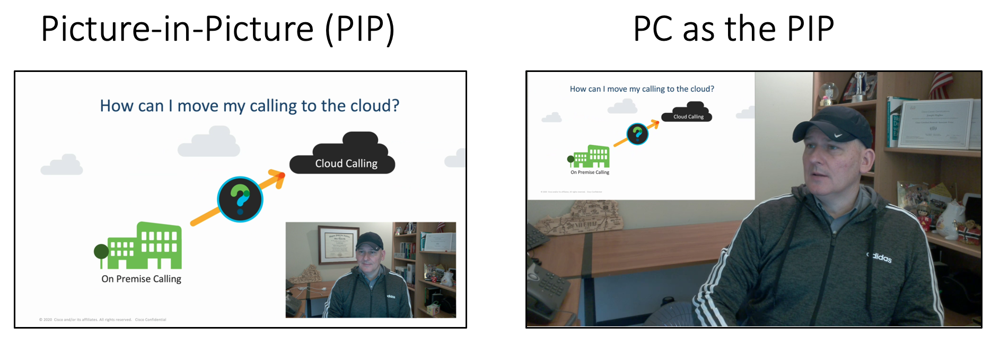

# webex-presenter-desk-pro
Uses the Webex Desk Pro feature of Immersive Share and adds some additional features like:  
- Move and resize your image.
- Change between Picture-in-Picture (PIP), PC PIP and Blend.
- Save the current view as a preset

Designed to work in a Webex Meeting.  Video is sent in the secondary content channel.   

**Note:** _The macro **dbMacro.js** also needs to be installed, but does not need to be enabled.  Presets are stored in this macro for cases when the macro engine is restarted or if the Desk Pro is turned off and on._ 
  
**Note:** _Requires CE9.15 or the latest RoomOS software_

  
**Screen shot of Touch 10**  
        
   
   
The macro does not require a touch panel be attached to the Desk Pro, but it makes it easier to see the screen when you use the buttons.  
  
***Some of the buttons:***   

## Webex Presenter tab

**Presets** - Press 1 time to recall.  Hold down for 3 seconds to store the current preset.  

**Hardcoded PC Background** - Select location.  Always uses blend. Cannot bet saved.  

**Clear (Show PC)** - removes the overlay and shows the last PC. 

**Reset to Default -->  Default (Main Cam Only)** - Return to sending main camera only. 
  
**Present Me** - Only presents you full screen in the content channel.  

**Present my PC** - Same as sharing your PC.  

## Move tab 

**Arrows: Up Down Left Right** - moves the current PIP or overlay up, down, left or right.  

**Zoom buttons** - Scale the PIP or overlay to larger or smaller

**Opacity (Blend only)** - Changes your opacity when the PC input is the virtual background.  

**PIP Blend and Video PIP** - Changes the view. 

##  

The macro remembers your last virtual background before selecting the PC as the virtual background.  When the **Default (Main Cam Only)** button is cliked it will return to this background (e.g. custom image, preloaded background, background blur, none).  This setting is stored in the touch panel in case of a script restart.  

In certain instances the macro automatically goes back to a default setting.  For example, if someone else shares content in a Webex meeting the macro returns to your main camera.  If the call ends, the macro automatically removes Immersive Share and returns to default settings. 

On startup, the macro determines if your USB-C or HDMI input is available.  If both are connected, it defaults to the USB-C input.  This can be overwritten by selecting the **Defaults** tab and selecting the **USB** or **HDMI** button next to **Default PC Overlay Source**.  This also stored in the touchpanel and is reset if the Desk Pro is powered on and off.  
